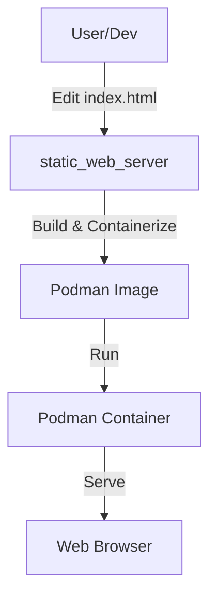

# rust-podman-atomic-deploy

Automated deployment of a static web page in a container using Rust and Podman.

## ✨ Features
- **🚀 Fast**: Lightweight Rust-based web server
- **🐳 Containerized**: Ready-to-deploy Podman containers 
- **🔧 Automated**: One-command deployment script
- **🛡️ Secure**: Rootless container support
- **📁 Simple**: Easy customization of static content
- **🌐 Production-ready**: Reverse proxy configuration examples

---

## 1. Introduction & Architecture



---

## 2. Requirements
- **Podman** (rootless or root mode)
- **Linux** (recommended, tested on Ubuntu/Fedora)
- **Rust** and **Cargo** (for building from source or using deployment script)

### Optional
- **Git** (for cloning the repository)
- **Nginx** or other reverse proxy (for production deployment)

---

## 3. Quick Start

### Option 1: Manual Build & Run
```bash
git clone https://github.com/ITSsafer-DevOps/rust-podman-atomic-deploy.git
cd rust-podman-atomic-deploy
podman build -f static_web_server/Podmanfile -t static_web_server:latest ./static_web_server
podman run --rm -d -p 8080:8080 static_web_server:latest
```

### Option 2: Automated Deployment Script
```bash
git clone https://github.com/ITSsafer-DevOps/rust-podman-atomic-deploy.git
cd rust-podman-atomic-deploy/deployment_script
cargo run
```
This will automatically build the Rust binary, create the container image, and start the container on port 80.

Open [http://localhost:8080](http://localhost:8080) (manual) or [http://localhost](http://localhost) (automated script) in your browser.

---

## 4. Customization

### How to deploy your own site
1. **Replace the HTML file**: Replace `static_web_server/index.html` with your own HTML file.
2. **Add assets** (optional): Add CSS, images, or other assets to `static_web_server/` directory.
3. **Modify server logic** (optional): Edit Rust code in `static_web_server/src/main.rs` if you want to serve multiple files or change server behavior.
4. **Rebuild and run**: Build and run the container using Quick Start instructions.

### Change port
- **Server code**: Edit port in `static_web_server/src/main.rs` (line 20)
- **Container configuration**: Update port mapping in `Podmanfile` if needed
- **Run with custom port**: `podman run --rm -d -p <your_port>:8080 static_web_server:latest`

### Example: Serving multiple files
To serve CSS and other assets, modify `static_web_server/src/main.rs`:
```rust
// Add path routing to serve different file types
// See the existing code for basic structure
```

---

## 5. Troubleshooting

### Common Issues

#### Podman UID/GID error:
**Symptom:**
```
ERRO[0000] running `/usr/bin/newuidmap ...`: newuidmap: write to uid_map failed: Invalid argument
invalid internal status, try resetting the pause process with "podman system migrate": cannot set up namespace using "/usr/bin/newuidmap": exit status 1
```

**Solution:**
```bash
echo "$(whoami):100000:65536" | sudo tee -a /etc/subuid /etc/subgid
podman system migrate
```
Then log out and log in again (or restart your session).

**Note:** Alternatively, you can use the provided fix script:
```bash
bash podman_userns_fix.sh
```

#### Port is busy:
```bash
netstat -tuln | grep 8080
# Kill the process or use another port
```

#### Container won't start:
- Check logs: `podman logs <container_id>`
- Ensure Podman is running and you have permissions.
- Verify the image was built successfully: `podman images`

---

## 6. Production Deployment

### Security Recommendations
- **Use HTTPS**: Set up a reverse proxy (nginx, traefik, Apache) for SSL/TLS termination
- **Firewall**: Configure firewall to allow only necessary ports (80, 443)
- **User namespaces**: Run containers in rootless mode for better security
- **Regular updates**: Keep Podman and host system updated

### Scaling & Performance
- **Load balancing**: Use multiple container instances behind a load balancer
- **Resource limits**: Set memory and CPU limits in production
- **Health checks**: Add health check endpoints to your Rust application
- **Logging**: Implement structured logging with the `tracing` crate

### Container Management
- **Orchestration**: Consider Podman Compose for multi-container setups
- **Auto-restart**: Configure containers to restart automatically on failure
- **Backup**: Regular backup of container data and configurations

### Example Reverse Proxy Configuration

#### Nginx
```nginx
server {
    listen 80;
    server_name your-domain.com;
    
    # Redirect HTTP to HTTPS
    return 301 https://$server_name$request_uri;
}

server {
    listen 443 ssl http2;
    server_name your-domain.com;
    
    ssl_certificate /path/to/your/cert.pem;
    ssl_certificate_key /path/to/your/key.pem;
    
    location / {
        proxy_pass http://localhost:8080;
        proxy_set_header Host $host;
        proxy_set_header X-Real-IP $remote_addr;
        proxy_set_header X-Forwarded-For $proxy_add_x_forwarded_for;
        proxy_set_header X-Forwarded-Proto $scheme;
    }
}
```

#### Systemd Service (Auto-start)
Create `/etc/systemd/system/static-web-server.service`:
```ini
[Unit]
Description=Static Web Server Container
After=network.target

[Service]
Type=forking
RemainAfterExit=yes
ExecStart=/usr/bin/podman run -d --name static-web-server -p 8080:8080 static_web_server:latest
ExecStop=/usr/bin/podman stop static-web-server
ExecStopPost=/usr/bin/podman rm static-web-server

[Install]
WantedBy=multi-user.target
```

Enable and start:
```bash
sudo systemctl enable static-web-server.service
sudo systemctl start static-web-server.service
```

---

## 7. Development & Customization Guide

### Key Files to Modify
- **`static_web_server/index.html`** – Your web page content
- **`static_web_server/src/main.rs`** – Server logic and routing
- **`static_web_server/Podmanfile`** – Container configuration
- **`deployment_script/src/main.rs`** – Automated deployment logic
- **README.md** – Update instructions for your team/users

### Development Workflow
1. Make changes to your HTML/CSS files
2. Test locally: `cd static_web_server && cargo run`
3. Build container: `podman build -f Podmanfile -t static_web_server:latest .`
4. Test container: `podman run --rm -p 8080:8080 static_web_server:latest`
5. Deploy to production

### Contributing
Contributions are welcome! Please:
1. Fork the repository
2. Create a feature branch
3. Make your changes
4. Test thoroughly
5. Submit a pull request

---

## 8. License
MIT License

Copyright (c) 2025 Kristián Kašník

Permission is hereby granted, free of charge, to any person obtaining a copy
of this software and associated documentation files (the "Software"), to deal
in the Software without restriction, including without limitation the rights
to use, copy, modify, merge, publish, distribute, sublicense, and/or sell
copies of the Software, and to permit persons to whom the Software is
furnished to do so, subject to the following conditions:

The above copyright notice and this permission notice shall be included in all
copies or substantial portions of the Software.

THE SOFTWARE IS PROVIDED "AS IS", WITHOUT WARRANTY OF ANY KIND, EXPRESS OR
IMPLIED, INCLUDING BUT NOT LIMITED TO THE WARRANTIES OF MERCHANTABILITY,
FITNESS FOR A PARTICULAR PURPOSE AND NONINFRINGEMENT. IN NO EVENT SHALL THE
AUTHORS OR COPYRIGHT HOLDERS BE LIABLE FOR ANY CLAIM, DAMAGES OR OTHER
LIABILITY, WHETHER IN AN ACTION OF CONTRACT, TORT OR OTHERWISE, ARISING FROM,
OUT OF OR IN CONNECTION WITH THE SOFTWARE OR THE USE OR OTHER DEALINGS IN THE
SOFTWARE.
