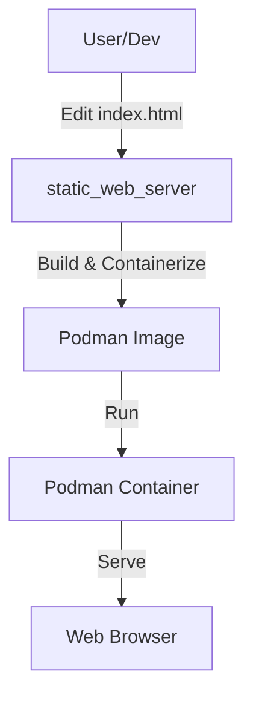

## Troubleshooting

### Problem: Podman build fails with newuidmap/user namespace error

**Symptom:**
```
ERRO[0000] running `/usr/bin/newuidmap ...`: newuidmap: write to uid_map failed: Invalid argument
invalid internal status, try resetting the pause process with "podman system migrate": cannot set up namespace using "/usr/bin/newuidmap": exit status 1
```

**Solution:**
1. Add UID/GID mapping for your user:
	```bash
	echo "$(whoami):100000:65536" | sudo tee -a /etc/subuid /etc/subgid
	```
2. Run Podman system migration:
	```bash
	podman system migrate
	```
3. Log out and log in again (or restart your session).
4. Retry the build and deployment commands from Usage Instructions.

**Note:** If the problem persists, ensure user namespaces are enabled in your Linux kernel and check `/etc/login.defs` for correct settings.


# rust-podman-atomic-deploy

Automated deployment of a static web page in a container using Rust and Podman.

---

## 1. Introduction & Architecture



---

## 2. Requirements
- Podman (rootless or root)
- Linux (recommended)

---

## 3. Quick Start
### Clone & Run
```bash
git clone https://github.com/ITSsafer-DevOps/rust-podman-atomic-deploy.git
cd rust-podman-atomic-deploy
podman build -f static_web_server/Podmanfile -t static_web_server:latest ./static_web_server
podman run --rm -d -p 8080:8080 static_web_server:latest
```
Open [http://localhost:8080](http://localhost:8080) in your browser.

---

## 4. Customization
### How to deploy your own site
1. Replace `static_web_server/index.html` with your own HTML file.
2. (Optional) Edit Rust code in `static_web_server/src/main.rs` if you want to serve more files or change server logic.
3. Optionally add more assets (CSS, images) to `static_web_server/` and update code/server as needed.
4. Build and run the container as in Quick Start.

### Change port
- Edit port in `static_web_server/src/main.rs` and in `Podmanfile`.
- Run: `podman run --rm -d -p <your_port>:8080 static_web_server:latest`

---

## 5. Troubleshooting
- **Podman UID/GID error:**
	```bash
	echo "$(whoami):100000:65536" | sudo tee -a /etc/subuid /etc/subgid
	podman system migrate
	```
- **Port is busy:**
	```bash
	netstat -tuln | grep 8080
	# Kill the process or use another port
	```
- **Container won't start:**
	- Check logs: `podman logs <container_id>`
	- Ensure Podman is running and you have permissions.

---

## 6. Production deployment

Recommendations for production:
- **Security:**
	- Use a reverse proxy (e.g. nginx, traefik) in front of the container for HTTPS, domain, rate limiting.
	- Set up a firewall, allow only necessary ports.
- **Scaling:**
	- For multiple pages/assets, extend Rust code to serve more files.
	- Use orchestration (e.g. Podman Compose, Kubernetes) for multiple containers.
- **Monitoring & logging:**
	- Add logging to Rust code (e.g. with `tracing` crate).
	- Add healthcheck to Podmanfile (e.g. with `HEALTHCHECK`).
- **Configuration:**
	- Edit ports, paths, COPY in Podmanfile as needed for your infrastructure.
	- Store assets in a separate folder, update server to serve them.

Example reverse proxy (nginx):
```nginx
server {
		listen 80;
		server_name your-domain.com;
		location / {
				proxy_pass http://localhost:8080;
				proxy_set_header Host $host;
				proxy_set_header X-Real-IP $remote_addr;
		}
}
```

---

## 7. What to edit for your own deployment
- `static_web_server/index.html` – your web page
- `static_web_server/src/main.rs` – server logic (optional)
- `static_web_server/Podmanfile` – container config (ports, files)
- README.md – update instructions for your team/users

---

## 8. License
MIT License

Copyright (c) 2025 Kristián Kašník

Permission is hereby granted, free of charge, to any person obtaining a copy
of this software and associated documentation files (the "Software"), to deal
in the Software without restriction, including without limitation the rights
to use, copy, modify, merge, publish, distribute, sublicense, and/or sell
copies of the Software, and to permit persons to whom the Software is
furnished to do so, subject to the following conditions:

The above copyright notice and this permission notice shall be included in all
copies or substantial portions of the Software.

THE SOFTWARE IS PROVIDED "AS IS", WITHOUT WARRANTY OF ANY KIND, EXPRESS OR
IMPLIED, INCLUDING BUT NOT LIMITED TO THE WARRANTIES OF MERCHANTABILITY,
FITNESS FOR A PARTICULAR PURPOSE AND NONINFRINGEMENT. IN NO EVENT SHALL THE
AUTHORS OR COPYRIGHT HOLDERS BE LIABLE FOR ANY CLAIM, DAMAGES OR OTHER
LIABILITY, WHETHER IN AN ACTION OF CONTRACT, TORT OR OTHERWISE, ARISING FROM,
OUT OF OR IN CONNECTION WITH THE SOFTWARE OR THE USE OR OTHER DEALINGS IN THE
SOFTWARE.
