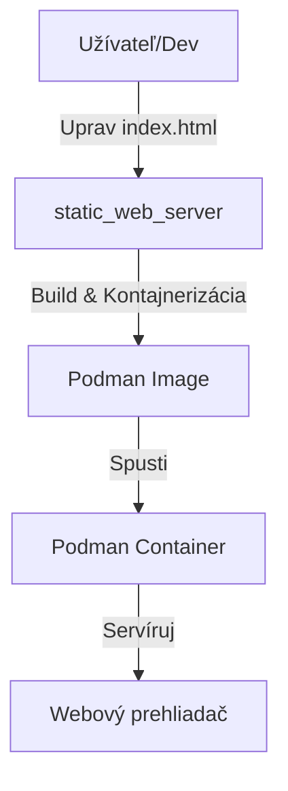

---

## 4a. Ako nasadiť vlastnú stránku

Chcete nasadiť vlastnú statickú stránku?
1. Nahraďte súbor `static_web_server/index.html` vlastným HTML súborom.
2. (Voliteľné) Upravte Rust kód v `static_web_server/src/main.rs` ak chcete obsluhovať viac súborov alebo zmeniť logiku servera.
3. Prípadne pridajte ďalšie assety (CSS, obrázky) do `static_web_server/` a upravte kód/server podľa potreby.
4. Buildnite a spustite kontajner podľa sekcie Rýchly štart.

---

## 4b. Ako použiť v produkčnom prostredí

Odporúčania pre produkčné nasadenie:
- **Bezpečnosť:**
	- Použite reverzný proxy (napr. nginx, traefik) pred kontajnerom pre HTTPS, doménu, rate limiting.
	- Nastavte firewall, povolte len potrebné porty.
- **Škálovanie:**
	- Pre viacero stránok alebo assetov rozšírte Rust kód na obsluhu viacerých súborov.
	- Použite orchestration (napr. Podman Compose, Kubernetes) pre viac kontajnerov.
- **Monitoring & logging:**
	- Pridajte logovanie do Rust kódu (napr. cez `tracing` crate).
	- Pridajte healthcheck do Podmanfile (napr. cez `HEALTHCHECK`).
- **Konfigurácia:**
	- Upravte porty, cesty, COPY v Podmanfile podľa infraštruktúry.
	- Uložte assety do samostatného priečinka, upravte server na ich obsluhu.

Príklad reverzného proxy (nginx):
```nginx
server {
		listen 80;
		server_name vase-domena.sk;
		location / {
				proxy_pass http://localhost:8080;
				proxy_set_header Host $host;
				proxy_set_header X-Real-IP $remote_addr;
		}
}
```

# rust-podman-atomic-deploy

Automatizované nasadenie statickej webovej stránky v kontajneri pomocou Rustu a Podmanu.

---

## 1. Úvod & Architektúra



---

## 2. Požiadavky
- Podman (rootless alebo root)
- Linux (odporúčané)

---

## 3. Rýchly štart
### Klonovanie & Spustenie
```bash
git clone https://github.com/ITSsafer-DevOps/rust-podman-atomic-deploy.git
cd rust-podman-atomic-deploy
podman build -f static_web_server/Podmanfile -t static_web_server:latest ./static_web_server
podman run --rm -d -p 8080:8080 static_web_server:latest
```
Otvorte [http://localhost:8080](http://localhost:8080) vo vašom prehliadači.

---

## 4. Prispôsobenie
### Vlastná stránka
- Nahraďte `static_web_server/index.html` vlastným HTML súborom.
- (Voliteľné) Upravte `static_web_server/src/main.rs` pre vlastnú logiku.
- Znovu buildnite kontajner podľa vyššie uvedených príkazov.

# rust-podman-atomic-deploy

Automatizované nasadenie statickej webovej stránky v kontajneri pomocou Rustu a Podmanu.

---

## 1. Úvod & Architektúra


---

## 2. Požiadavky
- Podman (rootless alebo root)
- Linux (odporúčané)

---

## 3. Rýchly štart
### Klonovanie & Spustenie
```bash
git clone https://github.com/ITSsafer-DevOps/rust-podman-atomic-deploy.git
cd rust-podman-atomic-deploy
podman build -f static_web_server/Podmanfile -t static_web_server:latest ./static_web_server
podman run --rm -d -p 8080:8080 static_web_server:latest
```
Otvorte [http://localhost:8080](http://localhost:8080) vo vašom prehliadači.

---

## 4. Prispôsobenie
### Ako nasadiť vlastnú stránku
1. Nahraďte súbor `static_web_server/index.html` vlastným HTML súborom.
2. (Voliteľné) Upravte Rust kód v `static_web_server/src/main.rs` ak chcete obsluhovať viac súborov alebo zmeniť logiku servera.
3. Pridajte ďalšie assety (CSS, obrázky) do `static_web_server/` a upravte kód/server podľa potreby.
4. Buildnite a spustite kontajner podľa sekcie Rýchly štart.

### Zmena portu
- Upravte port v `static_web_server/src/main.rs` a v `Podmanfile`.
- Spustite: `podman run --rm -d -p <váš_port>:8080 static_web_server:latest`

---

## 5. Riešenie problémov
- **Podman UID/GID chyba:**
	```bash
	echo "$(whoami):100000:65536" | sudo tee -a /etc/subuid /etc/subgid
	podman system migrate
	```
- **Port je obsadený:**
	```bash
	netstat -tuln | grep 8080
	# Ukončite proces alebo použite iný port
	```
- **Kontajner sa nespustí:**
	- Skontrolujte logy: `podman logs <container_id>`
	- Overte, že Podman beží a máte oprávnenia.

---

## 6. Produkčné nasadenie

Odporúčania pre produkčné nasadenie:
- **Bezpečnosť:**
	- Použite reverzný proxy (napr. nginx, traefik) pred kontajnerom pre HTTPS, doménu, rate limiting.
	- Nastavte firewall, povolte len potrebné porty.
- **Škálovanie:**
	- Pre viacero stránok alebo assetov rozšírte Rust kód na obsluhu viacerých súborov.
	- Použite orchestration (napr. Podman Compose, Kubernetes) pre viac kontajnerov.
- **Monitoring & logging:**
	- Pridajte logovanie do Rust kódu (napr. cez `tracing` crate).
	- Pridajte healthcheck do Podmanfile (napr. cez `HEALTHCHECK`).
- **Konfigurácia:**
	- Upravte porty, cesty, COPY v Podmanfile podľa infraštruktúry.
	- Uložte assety do samostatného priečinka, upravte server na ich obsluhu.

Príklad reverzného proxy (nginx):
```nginx
server {
		listen 80;
		server_name vase-domena.sk;
		location / {
				proxy_pass http://localhost:8080;
				proxy_set_header Host $host;
				proxy_set_header X-Real-IP $remote_addr;
		}
}
```

---

## 7. Čo upraviť pre vlastné nasadenie
- `static_web_server/index.html` – vaša web stránka
- `static_web_server/src/main.rs` – logika servera (voliteľné)
- `static_web_server/Podmanfile` – konfigurácia kontajnera (porty, súbory)
- README.sk.md – aktualizujte inštrukcie pre svoj tím/používateľov

---

## 8. Licencia
MIT licencia

Copyright (c) 2025 Kristián Kašník

Týmto sa bezplatne udeľuje každému, kto získa kópiu tohto softvéru a súvisiacich dokumentačných súborov ("Softvér"), povolenie nakladať so Softvérom bez obmedzení, vrátane (ale nie výlučne) práva používať, kopírovať, upravovať, spájať, zverejňovať, distribuovať, sublicencovať a/alebo predávať kópie Softvéru, a umožniť osobám, ktorým je Softvér poskytovaný, takto konať, za nasledujúcich podmienok:

Vyššie uvedené oznámenie o autorských právach a toto oznámenie o povolení musia byť zahrnuté vo všetkých kópiách alebo podstatných častiach Softvéru.

SOFTVÉR JE POSKYTOVANÝ „TAK, AKO JE“, BEZ ZÁRUKY AKÉHOKOĽVEK DRUHU, VÝSLOVNEJ ANI PREDPOKLADANEJ, VRÁTANE, ALE NIE VÝLUČNE, ZÁRUKY PREDAJNOSTI, VHODNOSTI NA KONKRÉTNY ÚČEL A NEPORUŠENIA PRÁV. V ŽIADNOM PRÍPADE NEBUDÚ AUTORI ANI DRŽITELIA AUTORSKÝCH PRÁV ZODPOVEDNÍ ZA AKÉKOĽVEK NÁROKY, ŠKODY ALEBO INÉ ZÁVÄZKY, ČI UŽ V KONANÍ ZMLUVNOM, DELIKTNOM ALEBO INOM, VYPLÝVAJÚCE Z, ALEBO V SÚVISLOSTI SO SOFTVÉROM ALEBO JEHO POUŽÍVANÍM ALEBO INÝMI AKTIVITAMI SO SOFTVÉROM.
