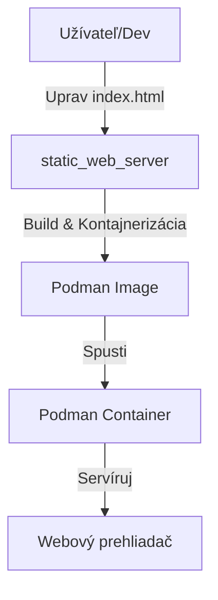

# rust-podman-atomic-deploy

Automatizované nasadenie statickej webovej stránky v kontajneri pomocou Rustu a Podmanu.

## ✨ Vlastnosti
- **🚀 Rýchle**: Ľahký webový server napísaný v Rust
- **🐳 Kontajnerizované**: Pripravené na nasadenie Podman kontajnery
- **🔧 Automatizované**: Nasadenie jedným príkazom
- **🛡️ Bezpečné**: Podpora rootless kontajnerov
- **📁 Jednoduché**: Ľahké prispôsobenie statického obsahu
- **🌐 Produkčne pripravené**: Príklady konfigurácie reverzného proxy

---

## 1. Úvod & Architektúra



---

## 2. Požiadavky
- **Podman** (rootless alebo root režim)
- **Linux** (odporúčané, testované na Ubuntu/Fedora)
- **Rust** a **Cargo** (pre build zo zdrojového kódu alebo použitie deployment skriptu)

### Voliteľné
- **Git** (pre klonovanie repozitára)
- **Nginx** alebo iný reverzný proxy (pre produkčné nasadenie)

---

## 3. Rýchly štart

### Možnosť 1: Manuálny Build & Spustenie
```bash
git clone https://github.com/ITSsafer-DevOps/rust-podman-atomic-deploy.git
cd rust-podman-atomic-deploy
podman build -f static_web_server/Podmanfile -t static_web_server:latest ./static_web_server
podman run --rm -d -p 8080:8080 static_web_server:latest
```

### Možnosť 2: Automatizovaný Deployment Skript
```bash
git clone https://github.com/ITSsafer-DevOps/rust-podman-atomic-deploy.git
cd rust-podman-atomic-deploy/deployment_script
cargo run
```
Toto automaticky zostaví Rust binárku, vytvorí kontajner image a spustí kontajner na porte 80.

Otvorte [http://localhost:8080](http://localhost:8080) (manuálne) alebo [http://localhost](http://localhost) (automatický skript) vo vašom prehliadači.
## 4. Prispôsobenie

### Ako nasadiť vlastnú stránku
1. **Nahraďte HTML súbor**: Nahraďte `static_web_server/index.html` vlastným HTML súborom.
2. **Pridajte assety** (voliteľné): Pridajte CSS, obrázky alebo iné assety do priečinka `static_web_server/`.
3. **Upravte logiku servera** (voliteľné): Upravte Rust kód v `static_web_server/src/main.rs` ak chcete obsluhovať viacero súborov alebo zmeniť správanie servera.
4. **Znovu zostavte a spustite**: Zostavte a spustite kontajner pomocou inštrukcií z Rýchleho štartu.

### Zmena portu
- **Kód servera**: Upravte port v `static_web_server/src/main.rs` (riadok 20)
- **Konfigurácia kontajnera**: Aktualizujte mapovanie portov v `Podmanfile` ak je potrebné
- **Spustenie s vlastným portom**: `podman run --rm -d -p <váš_port>:8080 static_web_server:latest`

### Príklad: Obsluha viacerých súborov
Pre obsluhu CSS a iných assetov upravte `static_web_server/src/main.rs`:
```rust
// Pridajte path routing pre obsluhu rôznych typov súborov
// Pozrite si existujúci kód pre základnú štruktúru
```

---

## 5. Riešenie problémov

### Časté problémy

#### Podman UID/GID chyba:
**Symptóm:**
```
ERRO[0000] running `/usr/bin/newuidmap ...`: newuidmap: write to uid_map failed: Invalid argument
invalid internal status, try resetting the pause process with "podman system migrate": cannot set up namespace using "/usr/bin/newuidmap": exit status 1
```

**Riešenie:**
```bash
echo "$(whoami):100000:65536" | sudo tee -a /etc/subuid /etc/subgid
podman system migrate
```
Potom sa odhláste a znovu prihláste (alebo reštartujte session).

**Poznámka:** Alternatívne môžete použiť priložený fix skript:
```bash
bash podman_userns_fix.sh
```

#### Port je obsadený:
```bash
netstat -tuln | grep 8080
# Ukončite proces alebo použite iný port
```

#### Kontajner sa nespustí:
- Skontrolujte logy: `podman logs <container_id>`
- Overte, že Podman beží a máte oprávnenia.
- Overte, že image bol úspešne zostavený: `podman images`

---

## 6. Produkčné nasadenie

### Bezpečnostné odporúčania
- **Použite HTTPS**: Nastavte reverzný proxy (nginx, traefik, Apache) pre SSL/TLS termináciu
- **Firewall**: Nakonfigurujte firewall na povolenie len potrebných portov (80, 443)
- **User namespaces**: Spúšťajte kontajnery v rootless režime pre lepšiu bezpečnosť
- **Pravidelné aktualizácie**: Udržujte Podman a hostiteľský systém aktuálny

### Škálovanie & Výkon
- **Load balancing**: Použite viacero inštancií kontajnerov za load balancerom
- **Obmedzenia zdrojov**: Nastavte limity pamäte a CPU v produkcii
- **Health checks**: Pridajte health check endpointy do vašej Rust aplikácie
- **Logovanie**: Implementujte štruktúrované logovanie s `tracing` crate

### Správa kontajnerov
- **Orchestrácia**: Zvážte Podman Compose pre multi-kontajnerové nastavenia
- **Auto-restart**: Nakonfigurujte kontajnery na automatický restart pri chybe
- **Zálohovanie**: Pravidelné zálohovanie dát a konfigurácií kontajnerov

### Príklad konfigurácie reverzného proxy

#### Nginx
```nginx
server {
    listen 80;
    server_name vasa-domena.sk;
    
    # Presmerovanie HTTP na HTTPS
    return 301 https://$server_name$request_uri;
}

server {
    listen 443 ssl http2;
    server_name vasa-domena.sk;
    
    ssl_certificate /cesta/k/vasmu/cert.pem;
    ssl_certificate_key /cesta/k/vasmu/key.pem;
    
    location / {
        proxy_pass http://localhost:8080;
        proxy_set_header Host $host;
        proxy_set_header X-Real-IP $remote_addr;
        proxy_set_header X-Forwarded-For $proxy_add_x_forwarded_for;
        proxy_set_header X-Forwarded-Proto $scheme;
    }
}
```

#### Systemd služba (Auto-start)
Vytvorte `/etc/systemd/system/static-web-server.service`:
```ini
[Unit]
Description=Static Web Server Container
After=network.target

[Service]
Type=forking
RemainAfterExit=yes
ExecStart=/usr/bin/podman run -d --name static-web-server -p 8080:8080 static_web_server:latest
ExecStop=/usr/bin/podman stop static-web-server
ExecStopPost=/usr/bin/podman rm static-web-server

[Install]
WantedBy=multi-user.target
```

Povoľte a spustite:
```bash
sudo systemctl enable static-web-server.service
sudo systemctl start static-web-server.service
```

---

## 7. Príručka pre vývoj & prispôsobenie

### Kľúčové súbory na úpravu
- **`static_web_server/index.html`** – Obsah vašej webovej stránky
- **`static_web_server/src/main.rs`** – Logika servera a routing
- **`static_web_server/Podmanfile`** – Konfigurácia kontajnera
- **`deployment_script/src/main.rs`** – Logika automatizovaného nasadenia
- **README.sk.md** – Aktualizujte inštrukcie pre váš tím/používateľov

### Workflow pre vývoj
1. Vykonajte zmeny vo vašich HTML/CSS súboroch
2. Testujte lokálne: `cd static_web_server && cargo run`
3. Zostavte kontajner: `podman build -f Podmanfile -t static_web_server:latest .`
4. Testujte kontajner: `podman run --rm -p 8080:8080 static_web_server:latest`
5. Nasaďte do produkcie

### Prispievanie
Príspevky sú vítané! Prosím:
1. Forkujte repozitár
2. Vytvorte feature branch
3. Vykonajte vaše zmeny
4. Dôkladne testujte
5. Odošlite pull request

---

## 8. Licencia
MIT licencia

Copyright (c) 2025 Kristián Kašník

Týmto sa bezplatne udeľuje každému, kto získa kópiu tohto softvéru a súvisiacich dokumentačných súborov ("Softvér"), povolenie nakladať so Softvérom bez obmedzení, vrátane (ale nie výlučne) práva používať, kopírovať, upravovať, spájať, zverejňovať, distribuovať, sublicencovať a/alebo predávať kópie Softvéru, a umožniť osobám, ktorým je Softvér poskytovaný, takto konať, za nasledujúcich podmienok:

Vyššie uvedené oznámenie o autorských právach a toto oznámenie o povolení musia byť zahrnuté vo všetkých kópiách alebo podstatných častiach Softvéru.

SOFTVÉR JE POSKYTOVANÝ „TAK, AKO JE“, BEZ ZÁRUKY AKÉHOKOĽVEK DRUHU, VÝSLOVNEJ ANI PREDPOKLADANEJ, VRÁTANE, ALE NIE VÝLUČNE, ZÁRUKY PREDAJNOSTI, VHODNOSTI NA KONKRÉTNY ÚČEL A NEPORUŠENIA PRÁV. V ŽIADNOM PRÍPADE NEBUDÚ AUTORI ANI DRŽITELIA AUTORSKÝCH PRÁV ZODPOVEDNÍ ZA AKÉKOĽVEK NÁROKY, ŠKODY ALEBO INÉ ZÁVÄZKY, ČI UŽ V KONANÍ ZMLUVNOM, DELIKTNOM ALEBO INOM, VYPLÝVAJÚCE Z, ALEBO V SÚVISLOSTI SO SOFTVÉROM ALEBO JEHO POUŽÍVANÍM ALEBO INÝMI AKTIVITAMI SO SOFTVÉROM.
